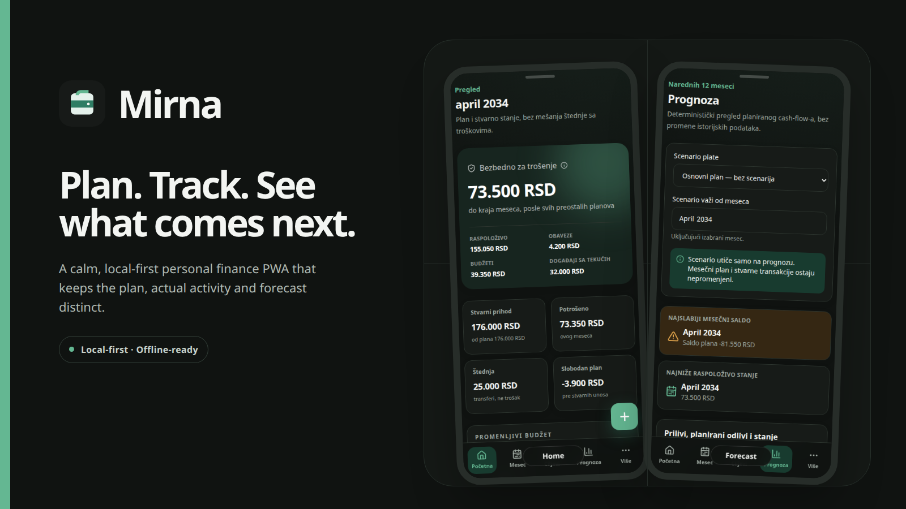
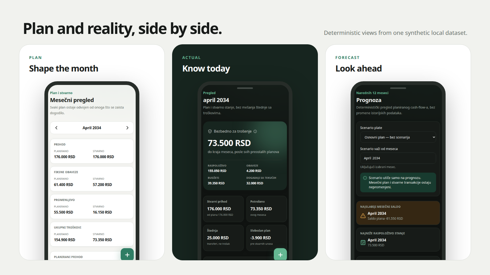
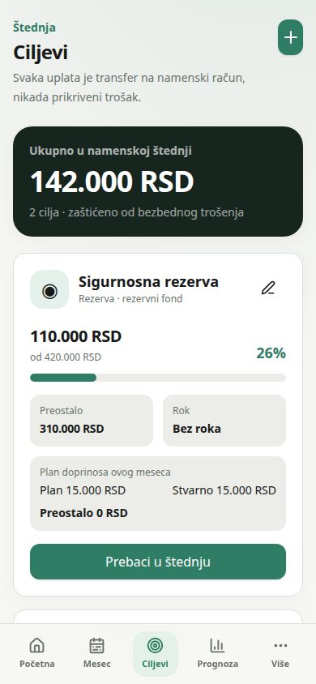
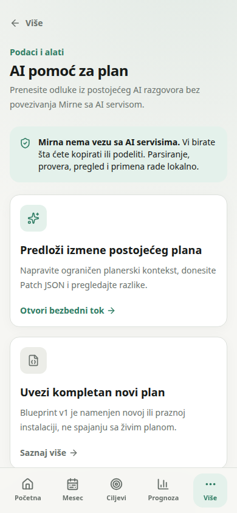

# Mirna

English | [Srpski](README.sr-Latn.md)

Mirna is a calm, local-first personal finance PWA for planning what should happen, recording
what actually happened, and seeing what comes next.

[](https://github.com/Gibo2706/mirna/actions)


[Live demo](https://mirna-finansije.vercel.app) ·
[Source](https://github.com/Gibo2706/mirna) ·
[Documentation](#project-documentation) ·
[Report an issue](https://github.com/Gibo2706/mirna/issues)



## Why Mirna

- **Plan and actual activity stay separate.** A budget is an intention; only a ledger entry
  changes an account.
- **The forecast shows where the plan becomes tight.** It projects known income, commitments,
  budgets, goals, debts, and one-off events without inventing financial advice.
- **Financial records remain local.** The normal workflow needs no account, bank connection,
  analytics service, or Mirna backend.

## See Mirna in action



### Goals stay connected to real accounts

Savings goals use dedicated accounts and transfers, so protected money is not presented as
available spending money.



### AI assistance stops at the planning boundary

Mirna prepares and reviews structured planning changes locally. It does not connect to an AI
provider or allow imported planning data to create ledger history.



## What it does

- **Plan the month:** recurring income, fixed commitments, variable budgets, debts, savings
  contributions, planned events, and salary scenarios.
- **Record reality:** auditable income and expenses, transfers, quick-entry presets, event
  payments, and plan-versus-actual views.
- **Protect future money:** reserve and sinking-fund goals backed by protected accounts, with
  deterministic progress and lifecycle rules.
- **Look ahead:** a twelve-month forecast that keeps historical transactions unchanged and makes
  pressure points visible.
- **Move data deliberately:** validated JSON backup schema v3, atomic restore, CSV export, and
  readable Markdown summaries.
- **Work offline:** an installable PWA application shell that continues to support local features
  after the first successful production load.
- **Bridge an existing plan:** Blueprint v1 for a new installation and allowlisted Patch v1
  changes for an existing plan.

## Local-first by design

Mirna stores financial data in IndexedDB for the current browser origin. It has no application
account, cloud synchronization, analytics, bank integration, or server-side copy of the
financial database. Exports happen only when requested.

> **Keep a separate backup.** Browser data can be cleared by profile changes, storage cleanup,
> operating-system actions, or PWA removal. JSON, CSV, and Markdown exports are plaintext and
> should be stored accordingly.

Read [PRIVACY.md](PRIVACY.md) and the
[security model](docs/SECURITY-MODEL.md) before using Mirna with sensitive information.

## Financial model

| Concept               | Meaning in Mirna                                                     |
| --------------------- | -------------------------------------------------------------------- |
| **Plan**              | Expected income, commitments, budgets, goals, debts, and events.     |
| **Actual**            | Ledger entries that really changed an account.                       |
| **Remaining**         | The unpaid or unspent part of the current plan.                      |
| **Transfers**         | Movement between accounts; never income or expense.                  |
| **Protected savings** | Cash excluded from safe-to-spend calculations.                       |
| **Forecast**          | A deterministic projection from current balances and the saved plan. |

The authoritative rules live in
[docs/FINANCIAL-INVARIANTS.md](docs/FINANCIAL-INVARIANTS.md).

## AI Plan Bridge

Mirna has no direct AI API or provider SDK. **Blueprint** describes a complete plan for a new or
empty installation. **Patch** proposes a restricted set of changes to an existing plan. The user
controls every copy, paste, review, and import step.

Neither format can silently alter existing balances or inject ledger transactions. See
[docs/AI-PLAN-BRIDGE.md](docs/AI-PLAN-BRIDGE.md).

## Try it

Open the [live demo](https://mirna-finansije.vercel.app). The current application interface is
Serbian Latin. The demo may trail the repository while a release is being prepared.

Mirna is a planning tool, not financial advice. Review the plan and keep a recoverable backup.

## Development

Mirna requires Node 22 and uses the committed npm lockfile.

```bash
nvm use
npm ci
npm run dev
```

The main stack is React 19, strict TypeScript, Vite 8, Tailwind CSS 4,
Dexie/IndexedDB, Zod, Recharts, Workbox, Vitest, and Playwright.

## Quality

```bash
npm run public:check
npm run public:history
npm run check
npm run test:coverage
npm run test:e2e
npm audit --omit=dev
```

Documentation visuals are reproducible from a frozen synthetic fixture:

```bash
npm run docs:assets
```

## Project documentation

- [Architecture](docs/ARCHITECTURE.md)
- [Financial invariants](docs/FINANCIAL-INVARIANTS.md)
- [Security model](docs/SECURITY-MODEL.md)
- [AI Plan Bridge](docs/AI-PLAN-BRIDGE.md)
- [Privacy](PRIVACY.md)
- [Contributing](CONTRIBUTING.md)

## Contributing

Issues, feature ideas, design discussion, and synthetic reproductions are welcome.
No contributor agreement is active yet, so external code and documentation changes are not
merged until contributor terms are finalized. Read [CONTRIBUTING.md](CONTRIBUTING.md).

## Security

Do not publish vulnerability details or real financial records. Follow
[SECURITY.md](SECURITY.md) and use
[GitHub Security](https://github.com/Gibo2706/mirna/security) once private vulnerability
reporting is enabled.

## License

Mirna is licensed under the
[GNU Affero General Public License version 3 only](LICENSE) (`AGPL-3.0-only`).
Commercial use is permitted subject to the license. Third-party components remain under their
own terms; see [THIRD_PARTY_NOTICES.md](THIRD_PARTY_NOTICES.md).

Copyright attribution is in [COPYRIGHT](COPYRIGHT). The source license does not grant permission
to present a modified build as an official Mirna release; see [TRADEMARKS.md](TRADEMARKS.md).

## Author

Mirna is an independent open-source project created and maintained by
[Bogdan Marković](https://github.com/Gibo2706) ([Gibo2706](https://github.com/Gibo2706)).
